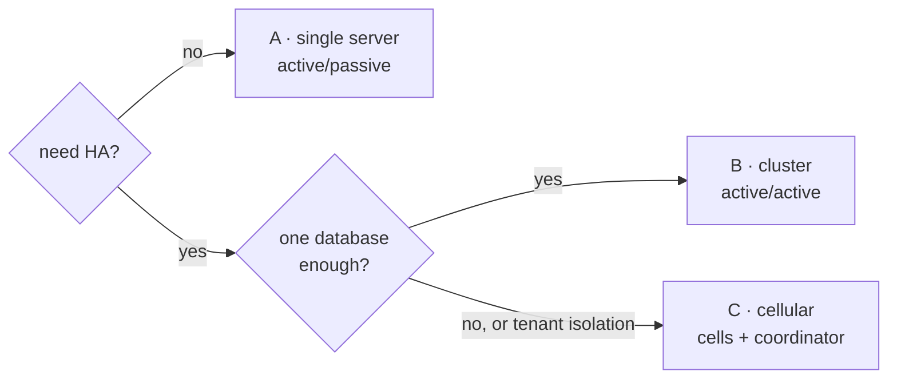

# Deploying Wiggle on Kubernetes

Three deployment profiles, one image, one rule that makes all of them simple: **every bit of
workflow state lives in the database**. A Wiggle node holds nothing that matters in memory, so
"failover" is never a data question — it's only a question of how many nodes are serving and where
the pods come back.

Pick a profile:

| Profile | Shape | Pick it when |
|---|---|---|
| [A · Single server, active/passive](#a--single-server-activepassive) | 1 node; Kubernetes reschedules it | small services, first production deploy |
| [B · Cluster, active/active](#b--cluster-activeactive) | N nodes on one database, all serving | production HA, zero-downtime rollouts |
| [C · Cellular](#c--cellular) | many cells (each its own DB + cluster) behind a Raft coordinator | multi-tenant isolation, scale-out past one DB |



All profiles use the same image — `hadielmougy/wiggle:2.1.8` — specialised entirely by env
(`WIGGLE_ROLE=cell | coordinator | console`), and the same workflows: **moving between profiles
never changes a workflow definition or a worker.** Workers are not part of these manifests: they
are pull-based processes in *your* services (any language) that long-poll the server over gRPC —
they need egress to port 8080, nothing inbound.

---

## A · Single server, active/passive

The honest version of active/passive with Wiggle: **the database is the state, so the "passive"
node is simply the next pod.** You run one replica; when it dies or its node drains, Kubernetes
reschedules it, and the new pod resumes every in-flight instance from rows — timers, leases,
parked signals included. There is no standby process to keep warm and no replication to operate
beyond your database's own.

```yaml
apiVersion: apps/v1
kind: Deployment
metadata:
  name: wiggle
spec:
  replicas: 1
  strategy: { type: Recreate }        # strict single-active; see the note below
  selector: { matchLabels: { app: wiggle } }
  template:
    metadata: { labels: { app: wiggle } }
    spec:
      containers:
        - name: wiggle
          image: hadielmougy/wiggle:2.1.8
          ports:
            - { containerPort: 8080, name: grpc }
            - { containerPort: 8090, name: health }
          env:
            - name: WIGGLE_NODE_NAME
              valueFrom: { fieldRef: { fieldPath: metadata.name } }
            - { name: WIGGLE_PORT, value: "8080" }
            - { name: WIGGLE_DASHBOARD_PORT, value: "8090" }   # /healthz probe endpoint
            - { name: WIGGLE_JDBC_URL, value: "jdbc:postgresql://postgres:5432/wiggle" }
            - { name: WIGGLE_JDBC_USER, value: "wiggle" }
            - name: WIGGLE_JDBC_PASSWORD
              valueFrom: { secretKeyRef: { name: wiggle-db, key: password } }
          readinessProbe:
            tcpSocket: { port: 8080 }
            initialDelaySeconds: 3
            periodSeconds: 3
          livenessProbe:
            httpGet: { path: /healthz, port: 8090 }
            initialDelaySeconds: 10
            periodSeconds: 10
---
apiVersion: v1
kind: Service
metadata: { name: wiggle }
spec:
  selector: { app: wiggle }
  ports:
    - { name: grpc, port: 8080, targetPort: 8080 }
```

Point it at your managed Postgres (RDS, Cloud SQL, …) — or MySQL, Oracle, or SQL Server; the JDBC
URL scheme picks the backend. The schema creates and migrates itself on startup (versioned,
forward-only, under a cross-node advisory lock), so there is no migration job to run.

**What failover looks like:** the pod dies → Kubernetes reschedules → the new pod reads where
every instance stands and continues. Steps that were leased to a worker when the node died are
redelivered when their lease expires (`WIGGLE_LEASE_MILLIS`, default 30s). Recovery time is pod
scheduling time, not data recovery time.

> **A note on `Recreate`.** It gives you a strict single-active posture — but it also means a gap
> during deploys. Because clustering in Wiggle is *just a shared database*, a rolling update that
> briefly runs two pods is completely safe: the two pods simply form a 2-node cluster for the
> overlap. If that's acceptable, drop the `strategy` block — and notice you're one line
> (`replicas: 3`) away from profile B. With Wiggle, active/active is not harder than
> active/passive; that's the point of the design.

**Ops console** (optional, separate Deployment — same image, different role):

```yaml
        - name: console
          image: hadielmougy/wiggle:2.1.8
          ports: [{ containerPort: 8090 }]
          env:
            - { name: WIGGLE_ROLE, value: "console" }
            - { name: WIGGLE_URL, value: "wiggle:8080" }
            - { name: WIGGLE_DASHBOARD_PORT, value: "8090" }
            - name: WIGGLE_DASHBOARD_PASSWORD
              valueFrom: { secretKeyRef: { name: wiggle-console, key: password } }
```

---

## B · Cluster, active/active

**Clustering is just a shared database.** Point several nodes at one Postgres and they form a
cluster: every node serves the gRPC API and hands out work; exactly one is elected leader for
clock-driven duties (timers, lease recovery, schedules). Kill any node — including the leader —
and the rest carry on; schedules fire exactly once even across leader failover. Clients need no
sticky sessions: any node answers any request, so a plain Service round-robins fine.

The only changes from profile A are the replica count, a rolling strategy, and two tuning knobs
worth setting under real load:

```yaml
apiVersion: apps/v1
kind: Deployment
metadata:
  name: wiggle
spec:
  replicas: 3
  strategy:
    rollingUpdate: { maxUnavailable: 1, maxSurge: 1 }   # zero-downtime rollouts
  selector: { matchLabels: { app: wiggle } }
  template:
    metadata: { labels: { app: wiggle } }
    spec:
      containers:
        - name: wiggle
          image: hadielmougy/wiggle:2.1.8
          ports:
            - { containerPort: 8080, name: grpc }
            - { containerPort: 8090, name: health }
          env:
            - name: WIGGLE_NODE_NAME
              valueFrom: { fieldRef: { fieldPath: metadata.name } }   # distinct name per pod
            - { name: WIGGLE_PORT, value: "8080" }
            - { name: WIGGLE_DASHBOARD_PORT, value: "8090" }
            # Timer/housekeeping cadence: the defaults (1000ms tick, batch 100) cap timer
            # throughput at ~100/s and add up to 1s latency to every sleep. Under load:
            - { name: WIGGLE_POLL_INTERVAL_MILLIS, value: "200" }
            - { name: WIGGLE_HOUSEKEEPING_BATCH, value: "500" }
            - { name: WIGGLE_JDBC_URL, value: "jdbc:postgresql://postgres:5432/wiggle" }
            - { name: WIGGLE_JDBC_USER, value: "wiggle" }
            - name: WIGGLE_JDBC_PASSWORD
              valueFrom: { secretKeyRef: { name: wiggle-db, key: password } }
            - { name: WIGGLE_JDBC_POOL_SIZE, value: "10" }   # × replicas ≤ your DB's limit
          readinessProbe:
            tcpSocket: { port: 8080 }
            initialDelaySeconds: 3
            periodSeconds: 3
          livenessProbe:
            httpGet: { path: /healthz, port: 8090 }
            initialDelaySeconds: 10
            periodSeconds: 10
---
apiVersion: v1
kind: Service
metadata: { name: wiggle }
spec:
  selector: { app: wiggle }
  ports:
    - { name: grpc, port: 8080, targetPort: 8080 }
---
apiVersion: policy/v1
kind: PodDisruptionBudget
metadata: { name: wiggle }
spec:
  minAvailable: 2
  selector: { matchLabels: { app: wiggle } }
```

**Sizing notes:**

- Node membership is heartbeat-based (`WIGGLE_HEARTBEAT_INTERVAL_MILLIS` 5s ×
  `WIGGLE_MISSED_HEARTBEATS` 3): a dead node's duties move to a peer within ~15s; its leased
  steps redeliver as leases expire.
- The **database is the shared resource** — size connections as `pool × replicas`, and treat
  retention as capacity: finished instances are purged after `WIGGLE_RETENTION_MILLIS`
  (default 24h). In our benchmarks, a database bloated with ~500k retained finished instances
  showed roughly **2× the latency** at the same load. Purge cadence is a capacity parameter,
  not housekeeping.
- One laptop-grade cluster sustains ~300 workflow starts/sec with sub-second completion —
  [full methodology](/performance/). When you outgrow one database, don't shard it: go cellular.

The console is identical to profile A (`WIGGLE_URL=wiggle:8080` — direct mode covers the whole
cluster, since every node sees the same database).

---

## C · Cellular

When one database is no longer enough — or tenants must not share blast radius — a namespace
becomes one or more **cells**: each a complete profile-B cluster with **its own database**. A
small **Raft coordinator** (embedded Ratis + RocksDB — no external store, no etcd) owns
placement: it publishes shard→cell rings as *epochs*, and instance ids carry their own routing
(`orders.e0.s3.01J…`), so nothing does directory lookups on the request path. The coordinator is
**not in the execution path** — in our failover test, SIGKILL-ing it under load cost a 5.4s gap
on *new* starts only; running work never noticed.

Deploy order: coordinator → cells → publish an epoch → console/clients.

### C.1 The coordinator (StatefulSet)

Stable identity + a PVC per pod (the Raft log and RocksDB state survive restarts *and*
reschedules), behind a headless Service so peers resolve each other by DNS:

```yaml
apiVersion: v1
kind: Service
metadata: { name: coordinator }
spec:
  clusterIP: None
  publishNotReadyAddresses: true   # peers must resolve each other BEFORE they are Ready,
  selector: { app: coordinator }   # or the Raft group can never form (bootstrap deadlock)
  ports:
    - { name: grpc, port: 8099, targetPort: 8099 }
    - { name: raft, port: 10000, targetPort: 10000 }
---
apiVersion: apps/v1
kind: StatefulSet
metadata: { name: coordinator }
spec:
  serviceName: coordinator
  replicas: 3                       # one Raft group; odd size for a majority
  podManagementPolicy: Parallel     # start peers together so the group can form quorum
  selector: { matchLabels: { app: coordinator } }
  template:
    metadata: { labels: { app: coordinator } }
    spec:
      containers:
        - name: coordinator
          image: hadielmougy/wiggle:2.1.8
          ports:
            - { containerPort: 8099, name: grpc }
            - { containerPort: 10000, name: raft }
          env:
            - name: POD_NAME
              valueFrom: { fieldRef: { fieldPath: metadata.name } }
            - name: WIGGLE_NODE_NAME
              valueFrom: { fieldRef: { fieldPath: metadata.name } }
            - { name: WIGGLE_ROLE, value: "coordinator" }
            - { name: WIGGLE_PORT, value: "8099" }
            - name: WIGGLE_COORD_STORE
              value: "ratis:///var/lib/wiggle/coord?peers=coordinator-0@coordinator-0.coordinator:10000,coordinator-1@coordinator-1.coordinator:10000,coordinator-2@coordinator-2.coordinator:10000&id=$(POD_NAME)"
          volumeMounts:
            - { name: coord-data, mountPath: /var/lib/wiggle/coord }
          readinessProbe:
            tcpSocket: { port: 8099 }
            initialDelaySeconds: 5
            periodSeconds: 3
  volumeClaimTemplates:
    - metadata: { name: coord-data }
      spec:
        accessModes: [ReadWriteOnce]
        resources: { requests: { storage: 1Gi } }
  persistentVolumeClaimRetentionPolicy: { whenDeleted: Delete, whenScaled: Delete }
```

The peer list is fixed at deploy time (each pod's `id` is its own name via `$(POD_NAME)`); the
control-plane state is tiny, so 1Gi is generous. A single-member group (`replicas: 1`, one peer
in the list) is fine for dev.

### C.2 A cell (its own database + cluster)

Each cell is profile B plus four env vars. One is a footgun worth bolding: **the node must
advertise its pod IP** — the coordinator dials cells at the address they announce, and without it
a node advertises `127.0.0.1` and the coordinator dials itself:

```yaml
apiVersion: apps/v1
kind: Deployment
metadata: { name: cell-a }
spec:
  replicas: 2
  selector: { matchLabels: { app: cell-a } }
  template:
    metadata: { labels: { app: cell-a } }
    spec:
      containers:
        - name: wiggle
          image: hadielmougy/wiggle:2.1.8
          ports:
            - { containerPort: 8080, name: grpc }
            - { containerPort: 8090, name: health }
          env:
            - name: WIGGLE_NODE_NAME
              valueFrom: { fieldRef: { fieldPath: metadata.name } }
            - name: WIGGLE_ADVERTISE_HOST              # REQUIRED in cellular mode
              valueFrom: { fieldRef: { fieldPath: status.podIP } }
            - { name: WIGGLE_ROLE, value: "cell" }
            - { name: WIGGLE_CELL_ID, value: "cellA" }
            - { name: WIGGLE_NAMESPACE, value: "orders" }
            - { name: WIGGLE_COORDINATOR_URL, value: "coordinator:8099" }
            - { name: WIGGLE_PORT, value: "8080" }
            - { name: WIGGLE_DASHBOARD_PORT, value: "8090" }
            - { name: WIGGLE_JDBC_URL, value: "jdbc:postgresql://db-cell-a:5432/wiggle" }
            - { name: WIGGLE_JDBC_USER, value: "wiggle" }
            - name: WIGGLE_JDBC_PASSWORD
              valueFrom: { secretKeyRef: { name: cell-a-db, key: password } }
          readinessProbe:
            tcpSocket: { port: 8080 }
            initialDelaySeconds: 3
            periodSeconds: 3
          livenessProbe:
            httpGet: { path: /healthz, port: 8090 }
            initialDelaySeconds: 10
            periodSeconds: 10
```

`db-cell-a` is that cell's **own** database — a separate managed instance per cell is the whole
point (separate failure domain, separate capacity). Repeat for `cell-b` with its own DB. Cell
nodes register with the coordinator by heartbeat; there is no static cell inventory to maintain.

### C.3 Publish an epoch (the namespace goes live)

A namespace is deliberately **not-ready until an epoch names its cells** — no implicit
placement. Publish the first shard→cell ring with the CLI:

```bash
wiggle use coordinator coordinator:8099
wiggle open-epoch -n orders 0=cellA 1=cellB     # shard 0 → cellA, shard 1 → cellB
wiggle allocations -n orders                    # verify placement
```

New instances now spread across both cells by consistent hashing. **Resharding later is another
`open-epoch`** — new instances follow the new ring, in-flight ones finish where they live, and
no data ever migrates. To retire a cell, publish an epoch without it and let it drain.

### C.4 Console and clients

```yaml
          env:
            - { name: WIGGLE_ROLE, value: "console" }
            - { name: WIGGLE_COORDINATOR_URL, value: "coordinator:8099" }
            - { name: WIGGLE_NAMESPACE, value: "orders" }
            - { name: WIGGLE_DASHBOARD_PORT, value: "8090" }
```

The console fans queries across the namespace's cells and routes cancel/signal to the owning
cell by instance id. Clients switch one line — `WiggleConnection.coordinator("coordinator:8099",
tls, region)` instead of `WiggleConnection.direct(...)` — and a `NamespaceWorker` runs one worker
per active cell, following rebalances automatically.

---

## Shared concerns (all profiles)

- **Probes.** Readiness: TCP on the gRPC port (8080 / 8099). Liveness: `GET /healthz` on
  `WIGGLE_DASHBOARD_PORT` — on a server/cell node that port serves *only* the probe (the UI is
  the console process).
- **TLS / mTLS.** A mounted keystore + `WIGGLE_TLS_KEYSTORE`(+`_PASSWORD`) turns TLS on for gRPC
  and HTTP alike; adding a truststore on the server requires client certificates. Unset =
  plaintext, so terminate TLS somewhere before untrusted networks.
- **Secrets.** The manifests above read `WIGGLE_JDBC_PASSWORD` / dashboard passwords from
  Kubernetes Secrets; every `WIGGLE_*` var can also be supplied as a system property.
- **Resource limits.** Start servers at ~1 CPU / 1–2Gi and measure; the engine is a single JVM
  with modest memory needs. Enable `WIGGLE_MEMORY_SHEDDING_ENABLED=true` to shed worker polls
  under heap pressure instead of dying.
- **Upgrades.** Nodes are stateless; roll them freely. Workflow definitions are content-hash
  versioned — in-flight instances finish on the graph they started with, so deploying new
  definitions never needs a migration window.

The complete variable reference lives in [Onboarding & configuration](/docs/onboarding/); the
cellular model in depth is [Sharding & epochs](/docs/sharding-and-epochs/).
