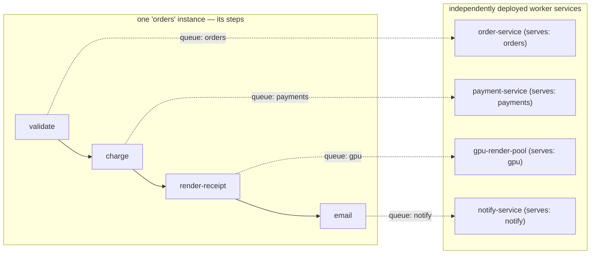
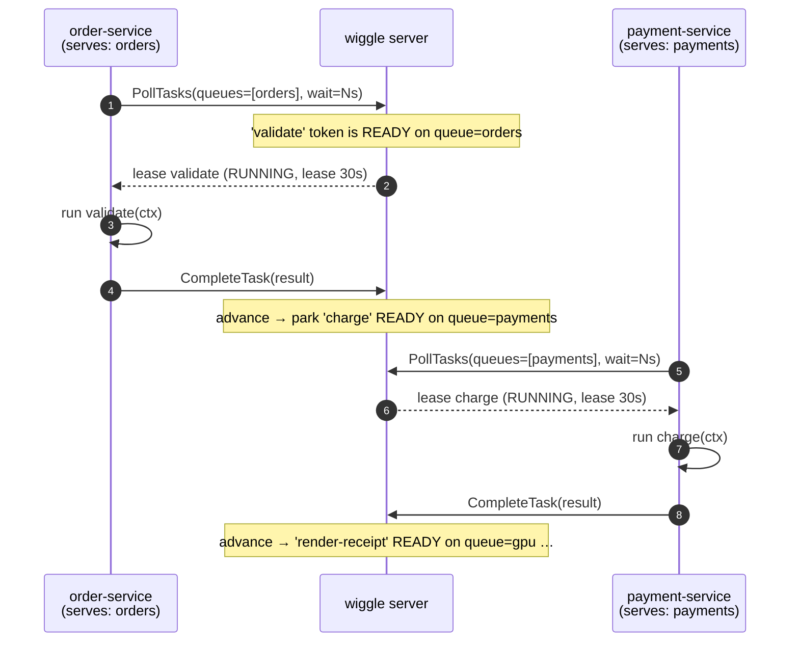
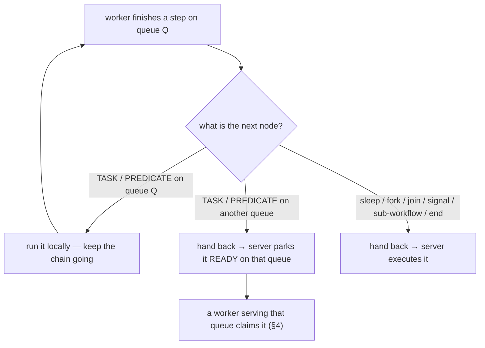

# Queues — distributing one workflow across many microservices

How wiggle spreads a single workflow's steps across independently deployed services. Each step carries a
**queue**; each service **serves** one or more queues and pulls work for them. The server routes every
step to its queue, so different services execute different steps of the *same* instance — no message
broker, no service-to-service calls, no inbound connectivity to the workers.

> One-line model: **a step names a queue; a service serves a queue; the server matches them.** Work is
> *pulled* by workers, never pushed — so services scale independently and need no open ports.

---

## 1. The picture

A step's queue decides which service runs it. With no queues declared, a workflow uses **one** queue
(its own name) and every worker registered for it shares the load. Declaring per-step queues splits the
flow across specialized services:



One instance; four services; the server hands each step to the service that serves its queue. `charge`
runs on the PCI-scoped payment service, `render-receipt` on the GPU pool, `email` on the egress-allowed
notify service — each deployed, scaled, and secured on its own.

---

## 2. Pin a step to a queue (authoring)

The queue is a trailing argument on a step (and on effects/gates). Or set a `defaultQueue` for every
step after it. Unset ⇒ the queue is the **workflow name**.

```java
Workflow.define("orders")
    .step("validate")                 // queue "orders" (the default)
    .step("charge", "payments")     // queue "payments"
    .step("render-receipt", "gpu")      // queue "gpu"
    .step("email", "notify")       // queue "notify"
    .build();
```

The queue is compiled onto each node (`Node.queue`) and collected into the definition's queue set. It is
a plain string label — there is no broker to declare or provision; the label *is* the routing key.

**Only worker steps are queued.** Tasks and predicates (gates) run on workers, so they carry a queue.
`sleep`, `fork`/`forEach`, `join`, `signal`, `sub-workflow`, and `end` are executed **server-side** and
are never routed to a queue — see §5.

---

## 3. Serve a queue (a worker = a microservice)

A worker registers the blueprints it can run and, by default, serves **every** queue those blueprints
mention. `withQueues(...)` restricts it — that's how you build a specialized service:

```java
// gpu-render-pool: a service that ONLY runs the "gpu" steps
Worker gpu = new Worker(client, "gpu-1",
                WorkerOptions.defaults().withQueues("gpu"))   // specialization
        .register(orders)          // knows the graph; will only claim gpu-queue steps
        .start();
```

```java
// order-service: default = serve every queue of the blueprints it registered
Worker general = new Worker(client, "order-1").register(orders).start();
```

A worker doesn't subscribe through a broker. It **long-polls** the server for its served queues; the
server leases it only tokens whose queue it serves. Nothing is ever pushed — a worker needs no inbound
connectivity and can scale to any number of replicas.

---

## 4. How the server routes a step to its queue

The routing is two moves the server makes with the same `queue` label:

1. **Stamp.** When an instance advances to a worker step, the server parks that step's token `READY` and
   stamps the token's `queue` from the node (`parkAtWorkerStep`: `token.queue = node.queue()`).
2. **Filter.** A poll claims the oldest `READY` tasks whose `queue` is in the worker's served set
   (`claimTasks` filters `queues.contains(token.queue)`), flips them to `RUNNING`, and stamps a
   **lease** owned by that worker.

So the token's queue (from the DSL) is exactly what the claim filters on. A worker receives a step **iff**
that step's queue ∈ the worker's served queues.



The lease gives **exactly-once dispatch** (only the lease owner may complete) and **at-least-once
execution** (if a worker dies, its lease expires and the step is redelivered to another worker on the
same queue — a long step keeps its lease alive with `HeartbeatTask`). The poll is a real long-poll: the
server holds the request open until work appears or the wait elapses, so idle queues cost no busy-polling.

---

## 5. Local execution and the queue boundary

To cut per-step round-trips, a worker can run a **chain** of consecutive steps in-process
(`LOCAL_SYNC` / `LOCAL_ASYNC` execution modes) instead of completing one step at a time (`SERVER` mode).
But it can only keep running steps **on a queue it serves**. At any other boundary it *hands back* to the
server, which routes the next step to whoever serves its queue:



The decision is one pure function (`GraphTraversal.classify`): a same-queue task/predicate is the only
thing a worker keeps; everything else — a different queue, or a server-executed node — is a handback. So
even inside a local chain, a step on another queue crosses to another service. Example
(`LocalBoundaryTest`): steps `a`, `b`, `d` on `general` and `c` on `special` — the `general` worker runs
`a`→`b`, hands back at `c`, the `special` worker runs `c`, and control returns to `general` for `d`.

> The server independently forces a handback whenever the next node isn't a worker step (fork/join/…),
> since no worker can run those locally regardless of queue. Queue *filtering* on the next poll is always
> enforced server-side, so a worker can never run a step off its queues even if it tried.

---

## 6. Why this is a microservice-distribution mechanism

- **A queue is a service boundary.** Put a step on a queue and only the pool serving that queue runs it:
  the GPU steps on GPU nodes, the PII steps in the compliance boundary, the slow third-party call in a
  pool sized for that latency — each deployed and scaled on its own.
- **One instance, many services.** The server keeps the durable state machine; services are stateless
  workers that pull the steps they own. Add replicas of any service to scale that stage independently.
- **No broker, no service mesh for this.** There's no queue infrastructure to run and no worker-to-worker
  calls — services only talk to the wiggle server, and only by pulling. Workers need no inbound ports.
- **Polyglot services on the same queues.** Workers in [Python](https://github.com/hadielmougy/wiggle-python)
  and [Go](https://github.com/hadielmougy/wiggle-go) speak the same control plane; dispatch is by queue +
  activity name, not by language, so a Go service and a Java service can run different steps of one flow.

---

## 7. Operating queues

- **Specialization pattern:** a step's queue argument (`step("render", fn, "gpu")`) paired with a
  dedicated pool (`WorkerOptions.defaults().withQueues("gpu")`). See README → *Running workers*.
- **Backpressure & fairness:** a worker only polls for `concurrency − in-flight` slots, and the server
  leases oldest-`READY`-first, so a queue's work is shared across its replicas without a step running
  twice.
- **Queue lag monitoring:** the server can warn when a queue accumulates a backlog with no throughput —
  see README → *Queue lag monitoring*.
- **Queues × cells are orthogonal.** Under a coordinator, `NamespaceWorker` runs one worker per active
  *cell* (sharded databases) and reconciles that set; it fans the *same* handlers/queues across cells and
  does not change queue semantics. Queues split a flow **by step**; cells shard instances **by id**. See
  [sharding-and-epochs.md](sharding-and-epochs.md).

---

## 8. Code map

| Concept | Where |
|---|---|
| default queue = workflow name; per-step `queue` | `client/**/dsl/Pipeline.java`, `client/**/dsl/WorkflowStream.java` |
| queue compiled onto a node; worker-step set | `core/**/Node.java`, `client/**/dsl/WorkflowDefinition.java` |
| a worker's served queues + specialization | `client/**/worker/Worker.java`, `client/**/worker/WorkerOptions.java` |
| long-poll for served queues | `client/**/worker/Worker.java` (`pollLoop`), `server/**/grpc/GrpcApi.java` |
| stamp token queue / claim-filter by queue | `server/**/engine/WorkflowEngine.java` (`parkAtWorkerStep`), `server/**/store/*Storage.java` (`claimTasks`) |
| local-vs-handback decision | `core/**/GraphTraversal.java` (`classify`), `server/**/engine/WorkflowEngine.java` (`applyRun`) |
| RPCs (`PollTasks`, `CompleteTask`, `AdvanceRun`, …) | `proto/src/main/proto/wiggle.proto` |
| queues across sharded cells | `client/**/worker/NamespaceWorker.java` |
