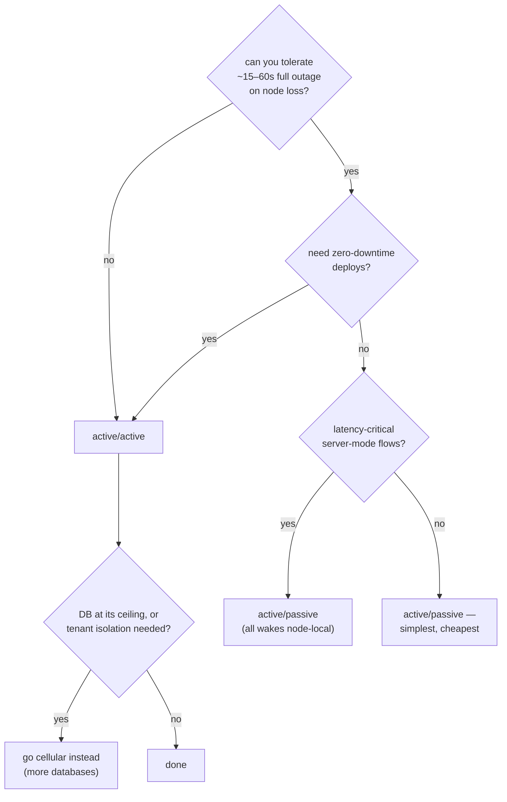

# Active/active vs active/passive — a decision guide

Both postures run the same image, the same workflows, and give the **same correctness
guarantees**. What differs is what happens in the seconds after something dies, what a deploy
costs, where latency comes from, and what you pay at the database. This guide covers the
mechanics of each, every dimension worth deciding on, the failure timelines, and the
configuration that matters for each posture. (Manifests for both live in the
[deployment guide](/deployment/).)

## First, the fact that changes the usual calculus

In most systems, active/passive means operating a standby: replication, promotion, split-brain
guards. **In Wiggle, every bit of workflow state is rows in the database** — a node holds nothing
in memory that matters. Two consequences reshape the whole comparison:

1. **The "passive" node doesn't exist as a process.** It's simply the next pod Kubernetes
   schedules. There is nothing to keep warm, nothing to promote, and no replication to run beyond
   your database's own.
2. **Active/active is not an upgrade project.** Clustering is *just a shared database*: point N
   nodes at one Postgres and they form a cluster. Moving from active/passive to active/active is
   a replica count and a rollout strategy — zero workflow, worker, or client changes.

So the real question is not "can we afford the complexity of active/active?" (there barely is
any) but "which failure/deploy/latency/cost trade-off fits this service?"

## How each posture actually works

### Active/passive (one node, Kubernetes reschedules it)

One replica serves everything: the gRPC API, work dispatch, and — as the only node, always the
leader — the clock-driven duties (timers, schedules, lease recovery). When the pod dies or its
node drains, Kubernetes reschedules it; the new pod reads where every instance stands and
continues. Steps that were leased to a worker at the moment of death are redelivered when their
lease expires. Timers that came due during the gap fire on resume. **Nothing is lost; everything
is late by the failover window.**

### Active/active (N nodes, one database)

Every node serves the API and hands out work — clients need no sticky sessions; a plain
Kubernetes Service round-robins. Exactly one node is elected **leader** for the clock-driven
duties, via heartbeats in the shared database. Kill any follower and nothing observable happens
beyond that node's connected workers reconnecting. Kill the leader and the API keeps serving
uninterrupted from the survivors while a new leader takes over the clock duties within the
heartbeat-detection window; schedules still fire **exactly once** across the transition, because
due-times are claimed transactionally in the database, not tracked in any node's memory.

## The decision dimensions

| Dimension | Active/passive | Active/active |
|---|---|---|
| **Node loss** | full outage for the failover window (typically 15–60s, see timelines) | API keeps serving; leader duties pause ≤ ~15s if the leader died; ~zero if a follower died |
| **Deploys** | a gap (`Recreate`) — or a brief 2-node overlap, which is safe | zero-downtime rolling updates |
| **Dispatch latency** | best possible: all wake-on-produce is node-local | cross-node dispatch pays the fallback re-claim — up to `WIGGLE_FALLBACK_POLL_MILLIS` (100ms); the adaptive ramp cuts the measured p50 from 105ms to 30ms |
| **Throughput** | one node's API/dispatch capacity | N× API/poll capacity — but **the database is the shared ceiling**; nodes don't multiply DB throughput |
| **Cost** | 1 pod; smallest DB connection pool | N pods; `pool × N` DB connections; a PodDisruptionBudget |
| **Timer/schedule duties** | down during any outage (the only node is the leader) | survive any single node loss with ≤ ~15s pause |
| **Correctness** | identical | identical — exactly-once dispatch, at-least-once execution, leases, content-hash versioning; the DB arbitrates in both |
| **Operational surface** | one Deployment | one Deployment with `replicas: N` — no extra infrastructure either way |
| **Real SPOF** | the database | the database (unchanged — HA for it is your DB's HA, e.g. RDS Multi-AZ) |

Three of these rows deserve emphasis:

- **Correctness is a non-dimension.** Both postures give the same guarantees because the database
  arbitrates every claim. Active/active adds zero split-brain or double-execution risk — a step is
  dispatched exactly once no matter how many nodes could have dispatched it. Choose on
  availability, latency, and cost alone.
- **Throughput is a weaker argument for active/active than it looks.** Nodes multiply API and
  long-poll capacity, not database capacity — and the database is usually the binding constraint
  (in our [benchmarks](/performance/), the DB was the ceiling well before the node was). If you're
  adding nodes for throughput rather than availability, you likely want
  [cells](/deployment/#c--cellular) instead: more databases, not more nodes on one.
- **Latency mildly favors active/passive.** On a single node, every completion wakes the next
  step's poller instantly (wake-on-produce is node-local). In a cluster, work produced via node A
  reaches a worker parked on node B only via the periodic fallback re-claim. Measured on a real
  2-node cluster: cross-node dispatch p50 of ~105ms with the fixed default, ~30ms with
  `WIGGLE_ADAPTIVE_FALLBACK_POLL=true`. If your flows use `LOCAL_SYNC`/`LOCAL_ASYNC` chaining
  (most should), few hops cross the server at all and this mostly disappears.

## Failure timelines, concretely

**Active/passive — pod dies:**

1. Detection: the liveness probe notices (default config: 10s period ⇒ up to ~10–30s), or
   immediately if the process exited.
2. Reschedule + boot: Kubernetes places the pod and the JVM starts (~5–15s; the schema migration
   check on boot is a no-op when current).
3. Resume: the node reads instance state and is leader immediately. Due timers fire; steps leased
   to workers at death redeliver as leases expire (`WIGGLE_LEASE_MILLIS`, default 30s).

**Total: roughly 15–60s of full unavailability**, tunable mostly via probe timings. Workers
reconnect automatically (gRPC retry); in-flight instances resume exactly where they were.

**Active/active — follower dies:** nothing user-visible. Its connected workers reconnect through
the Service to surviving nodes; its leased steps redeliver on lease expiry.

**Active/active — leader dies:** the API never blips (survivors keep serving). Clock duties pause
until a survivor takes leadership: `WIGGLE_HEARTBEAT_INTERVAL_MILLIS` (5s) ×
`WIGGLE_MISSED_HEARTBEATS` (3) ⇒ **~15s** by default. A timer due in that window fires ~15s late,
once. Schedules can't double-fire across the handover — firing is a transactional claim.

**Either posture — database down:** everything is down. This is the honest architecture note:
node redundancy does not protect you from the actual single point of failure. Put your HA budget
into the database first (managed Multi-AZ), nodes second. When one database can't carry the
load — or tenants must not share its blast radius — that's the [cellular](/deployment/#c--cellular)
threshold, not an argument for more nodes.

## Configuration reference

Everything is an env var (or the same-named system property). **Shared** settings apply to both
postures; the last column says where a knob actually matters.

| Variable | Default | Meaning | Matters most in |
|---|---|---|---|
| `WIGGLE_JDBC_URL` / `_USER` / `_PASSWORD` | *(unset = in-memory)* | the database — the state | both (it *is* the posture) |
| `WIGGLE_JDBC_POOL_SIZE` | `10` | HikariCP pool per node — size `pool × replicas` against the DB's connection limit | active/active |
| `WIGGLE_NODE_NAME` | hostname | cluster membership identity — set from the pod name, **distinct per pod** | active/active |
| `WIGGLE_HEARTBEAT_INTERVAL_MILLIS` | `5000` | node heartbeat cadence | active/active |
| `WIGGLE_MISSED_HEARTBEATS` | `3` | beats missed before a node is dead ⇒ **leader-failover window = interval × missed (~15s)**; lower for faster takeover, at more false-positive risk | active/active |
| `WIGGLE_LEASE_MILLIS` | `30000` | step lease — how long until a dead worker's (or dead node's) claimed steps redeliver | both |
| `WIGGLE_POLL_INTERVAL_MILLIS` | `1000` | leader housekeeping tick (timers, reclaims, schedules) | both (the leader runs it) |
| `WIGGLE_HOUSEKEEPING_BATCH` | `100` | items per housekeeping sweep — with the fixed sweep, throughput caps at batch÷tick | both |
| `WIGGLE_ADAPTIVE_HOUSEKEEPING` | `false` | full-batch sweeps drain until partial — removes the promotion ceiling under backlog (measured ~17×) | both |
| `WIGGLE_FALLBACK_POLL_MILLIS` | `100` | parked long-poll re-claim interval — the cross-node dispatch latency bound | active/active |
| `WIGGLE_ADAPTIVE_FALLBACK_POLL` | `false` | fresh parks re-claim at fallback÷4 and decay — measured cross-node p50 105→30ms | active/active |
| `WIGGLE_DISPATCH_LINGER_MILLIS` | `5` | wake-on-produce batching linger | both |
| `WIGGLE_LONGPOLL_MAX_MILLIS` | `20000` | server-side long-poll hold | both |
| `WIGGLE_RETENTION_MILLIS` | `86400000` | finished-instance retention — a capacity parameter (bloat measured ≈2× latency) | both |
| `WIGGLE_MEMORY_SHEDDING_ENABLED` | `false` | shed a fraction of polls under heap pressure instead of dying | both |
| `WIGGLE_DASHBOARD_PORT` | `0` (off) | the `/healthz` probe port | both |

**Kubernetes-side knobs** (not env): active/passive wants `replicas: 1` + `strategy: Recreate`
(or drop `Recreate` and accept a safe 2-node overlap during rollouts) and liveness-probe timings
tuned to your tolerable detection window. Active/active wants `replicas: 3` (or more), a
`rollingUpdate` strategy, and a `PodDisruptionBudget` (`minAvailable: 2`) so voluntary evictions
never take the cluster below quorum-of-service. Full manifests: [deployment guide](/deployment/).

## Choosing

**Pick active/passive when:** it's a small or internal service; a sub-minute outage on node loss
is acceptable; you want the absolute minimum footprint; or your flows are latency-critical,
server-dispatched, and single-node wake-on-produce matters more than availability.

**Pick active/active when:** node loss must not stop the API; you deploy during business hours
and want zero-downtime rollouts; workers and clients fan out enough to use the extra poll/API
capacity. Set `WIGGLE_ADAPTIVE_FALLBACK_POLL=true` and mind `pool × replicas`.

**Pick neither — go [cellular](/deployment/#c--cellular) — when:** the *database* is the
bottleneck or the blast-radius concern. More nodes on one database solve neither.

And remember the escape hatch that makes this a low-stakes decision: **switching later is a
replica count.** Start active/passive; the day you need active/active, set `replicas: 3`, switch
the strategy to rolling, add the PDB — your workflows, workers, and clients won't notice.
