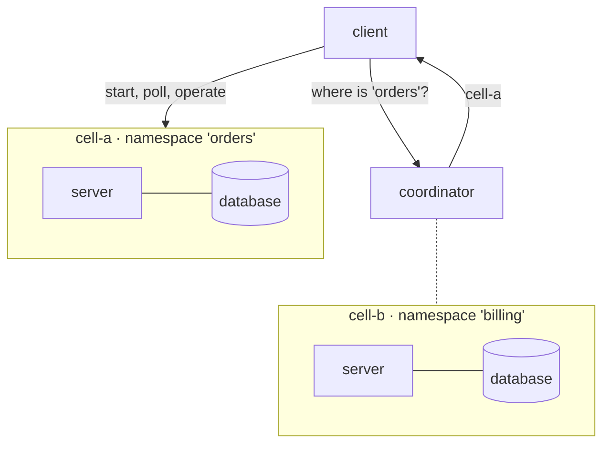

# 3 · Coordinator and cells

A **cell** is a complete wiggle: a server and its own database, holding one namespace's work. A
**coordinator** is a small control plane that knows which cell holds which shard of which namespace,
and answers the client's question "where does this go?".

That buys you a blast radius. One tenant's database is not another tenant's database; one cell's
outage is not everyone's outage; a region's work can live in that region. It costs you two extra
moving parts and one operator step with no default, so take this tutorial when you need the
isolation — not before.

The flow and handlers are unchanged from **[tutorial 1](/tutorial/embedded/)**.

## The shape



The coordinator is **never** in the data path. It answers routing questions and the client caches the
answer; work flows straight from client to cell. It also never depends on the engine — coordinator
and server share only a gRPC contract.

## 1. The databases

A cell's database, and a small one for the coordinator itself:

```bash
docker network create wiggle-net

docker run -d --name cell-a-db --network wiggle-net \
    -e POSTGRES_USER=wiggle -e POSTGRES_PASSWORD=wiggle -e POSTGRES_DB=wiggle \
    postgres:16-alpine

docker run -d --name coord-db --network wiggle-net \
    -e POSTGRES_USER=coord -e POSTGRES_PASSWORD=coord -e POSTGRES_DB=coord \
    postgres:16-alpine
```

## 2. The coordinator

```bash
docker run -d --name coordinator --network wiggle-net -p 8099:8099 \
    -e WIGGLE_ROLE=coordinator -e WIGGLE_PORT=8099 \
    -e WIGGLE_COORD_STORE=jdbc:postgresql://coord-db:5432/coord \
    -e WIGGLE_COORD_JDBC_USER=coord -e WIGGLE_COORD_JDBC_PASSWORD=coord \
    hadielmougy/wiggle:0.0.7
```

`WIGGLE_ROLE=coordinator` runs a control plane and no engine — it never becomes a cell. Leaving
`WIGGLE_COORD_STORE` unset keeps its state in memory, which is fine for a first run and wrong for
anything else: the control plane would forget every placement on restart. Several coordinators may
share one store; leader election over it keeps them single-writer.

## 3. A cell

```bash
docker run -d --name cell-a --network wiggle-net -p 8080:8080 \
    -e WIGGLE_JDBC_URL=jdbc:postgresql://cell-a-db:5432/wiggle \
    -e WIGGLE_JDBC_USER=wiggle -e WIGGLE_JDBC_PASSWORD=wiggle \
    -e WIGGLE_COORDINATOR_URL=coordinator:8099 \
    -e WIGGLE_NAMESPACE=orders \
    -e WIGGLE_CELL_ID=cell-a \
    hadielmougy/wiggle:0.0.7
```

Three variables make a server a cell: **which coordinator** to talk to, **which namespace** it holds,
and **which cell** it belongs to. `WIGGLE_CELL_ID` is required — a coordinated node with no cell id
is rejected, because "which cell is this?" has no safe default. It registers itself on boot and
heartbeats from then on.

## 4. Place the namespace — the step with no default

A registered cell is not yet a *placed* cell. Until a **ring** names it, it is on standby: it mints
no ids and takes no work. This is deliberate — a coordinated namespace is placed by an explicit ring
and nothing else, so no cell silently starts owning data because it happened to boot.

<!-- snippet: tut-coordinated/open-epoch -->
```java
/**
 * A coordinated namespace is placed by an explicit ring and nothing else: until an epoch names a
 * cell, that cell is on standby and mints no ids. This is the one operator step with no default.
 */
public static void placeNamespace(CoordinatedConnection wiggle, String namespace, String cellId) {
    wiggle.openEpoch(namespace, List.of(
            RingSlot.newBuilder().setShard(0).setCellId(cellId).build()));
}
```

One shard, one cell. Resharding later is another `openEpoch` with a different ring: the new epoch
starts minting immediately and the previous one drains, which is why ids carry their epoch. See
[Sharding & epochs](/docs/sharding-and-epochs/).

## 5. Run it

<!-- snippet: tut-coordinated/main -->
```java
public static void main(String[] args) throws Exception {
    try (CoordinatedConnection wiggle =
                 WiggleConnection.coordinator("localhost:8099", Tls.Options.DISABLED, "eu-west")) {

        placeNamespace(wiggle, "orders", "cell-a");        // once, at provisioning time

        WiggleClient client = wiggle.clientForNamespace("orders");   // routed to the owning cell
        FlowSpec orders = Orders.spec();
        client.register(orders);

        try (Worker worker = new Worker(client, "worker-1")
                .registerHandler(new OrderHandlers())
                .start()) {

            String id = client.start(orders, new Orders.Order("A-1001",
                    List.of(new Orders.Item("PEN", new BigDecimal("2.50")),
                            new Orders.Item("PAD", new BigDecimal("4.00"))),
                    BigDecimal.ZERO, "NEW"));

            // the id carries its own namespace, epoch and shard -- it is self-routing
            IdCodec.Placement p = IdCodec.parse(id).orElseThrow();
            System.out.println("started " + id + " in " + p.namespace() + " epoch " + p.epoch());

            InstanceView done = wiggle.clientForInstance(id)
                    .awaitCompletion(id, Duration.ofSeconds(30));
            System.out.println(done.status() + " " + done.context());
        }
    }
}
```

The third argument to `coordinator(...)` is your region. The coordinator prefers a cell in it when
one exists, so a client in `eu-west` is not routed across an ocean.

## Self-routing ids

An instance id carries its **namespace, epoch and shard**. That is why `clientForInstance(id)` needs
no lookup table: any id can be resolved to the cell holding it, even after a reshard moved its
namespace, because the id remembers the epoch it was minted in.

It is also why a cell on standby mints nothing. An id it forged would claim a placement the ring
never gave it.

## Adding a second namespace

Run another database and another cell with `WIGGLE_NAMESPACE=billing` and
`WIGGLE_CELL_ID=cell-b`, then `openEpoch("billing", ring(0 → "cell-b"))`. The two share a
coordinator and nothing else — separate servers, separate databases, separate failure domains. A
client gets to either with `clientForNamespace`.

## Where to go next

- **[Per-tenant isolation (cells)](/patterns/cells/)** — the pattern behind this deployment.
- **[Sharding & epochs](/docs/sharding-and-epochs/)** — resharding, draining, and why ids carry
  their epoch.
- **[Active/active vs active/passive](/high-availability/)** — running more than one node per cell.
- **[Deploying on Kubernetes](/deployment/)** — the same topology with manifests and Helm.
