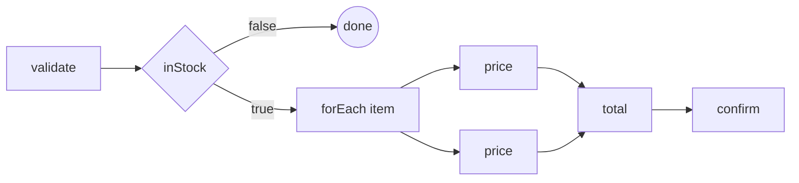

# Tutorials

Three complete walkthroughs, each on one page, each ending with a workflow that has actually run.
They build the **same flow** on three different deployments — which is the point: the deployment
shape is not a property of the workflow.

| | Start here if |
|---|---|
| **[1 · Embedded server](/tutorial/embedded/)** | you want a durable workflow inside one service, on a database you already run. One process, one `main`. |
| **[2 · Standalone server](/tutorial/standalone/)** | the engine should be its own deployment, with your services as clients and workers around it. |

They are ordered by how much infrastructure they ask for, not by capability. The flow, the handlers
and the client API are identical in all three; what changes is where the server lives and who tells
the client which one to talk to.

## The flow they all build

An `orders` flow that validates an order, skips out cleanly if it is too large, prices each line
item **in parallel**, totals them, and confirms:



## Prerequisites, for all three

- **Java 21** or newer
- **Docker** (tutorials 2 and 3; tutorial 1 only needs a database)
- the client dependency:

```kotlin
dependencies {
    implementation("sh.wiggle:wiggle-client-all:0.0.7")
}
```

`wiggle-client-all` is the client shaded into one jar with gRPC and protobuf relocated, so it stays
out of the way of whatever your service already uses. For the unshaded modules, import
`sh.wiggle:wiggle-bom` and depend on `wiggle-client`.

Every line of Java on these pages is compiled and run by the project's test suite — including the
three `main` methods, each against a real server. If a page shows it, it works.
