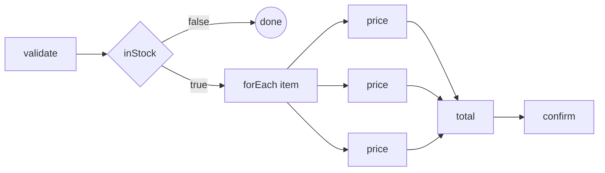

# Your first workflow

This is the shortest path from nothing to a durable workflow running on your machine, end to end.
Follow it in order and you finish with an order-pricing flow that survives a worker being killed
mid-run — about fifteen minutes, most of it waiting for a container to pull.

Every line of Java on these pages is compiled and run by the project's own test suite. If a page
shows it, it works.

## What you'll build

An `orders` flow that validates an order, skips out cleanly if it is too large, prices each line
item **in parallel**, totals them, and confirms:



Four ideas, in the order you meet them:

| | |
|---|---|
| **the flow is data** | you publish a *topology* — names and edges. No lambdas, no code in the graph |
| **handlers are ordinary methods** | a plain class; the worker binds methods to step names |
| **a gate is not a failure** | `inStock` returning false ends the instance *successfully* |
| **fan-out is explicit** | branches are isolated, so rejoining is a step you write |

## Prerequisites

- **Java 21** or newer
- **Docker**, to run the server (or a PostgreSQL you already have — see
  [Onboarding](/docs/onboarding/))
- a build tool; the snippets below are Gradle, Maven works the same

## The dependency

```kotlin
dependencies {
    implementation("sh.wiggle:wiggle-client-all:0.0.4")
}
```

`wiggle-client-all` is the client shaded into one jar with gRPC and protobuf relocated, which keeps
it out of the way of whatever your service already uses. If you'd rather have the unshaded modules,
import the `sh.wiggle:wiggle-bom` and depend on `wiggle-client`.

## Start a server

```bash
docker run --rm -p 8080:8080 hadielmougy/wiggle:0.0.4
```

That's an in-memory server — perfect for a tutorial, and everything you learn here is unchanged when
you point it at PostgreSQL. It listens for gRPC on `8080`.

Leave it running and go to **[The flow](/tutorial/the-flow/)**.
