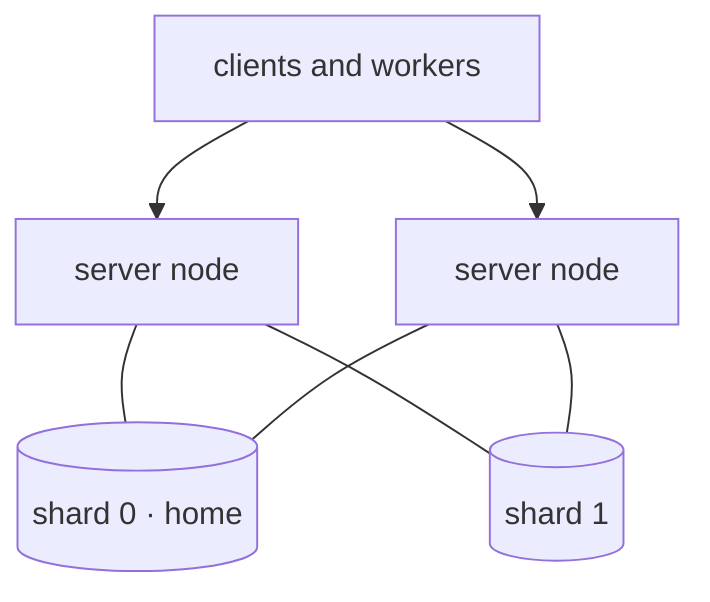

# 3 · Sharded server

One database is the ceiling: a single PostgreSQL primary sets how many steps per second a cluster
can commit. **Sharding** spreads one cluster's instances over several databases. Every server node
connects to every shard, each instance lives entirely on one of them, and clients do not know shards
exist.

The flow, the handlers and the client are unchanged from **[tutorial 2](/tutorial/standalone/)**.
Only the server's configuration changes.

> **Sharding ships in the release after 0.0.9.** Until then, build the image from `main`:
>
> ```bash
> docker build -t wiggle:main https://github.com/hadielmougy/wiggle.git#main
> ```

## The shape



Every node serves every request. A new instance is minted on one shard, chosen by weight, and its id
records which: `wfi.s1.01m446vf4tcd…` lives on shard 1. Everything that instance does afterwards
(its steps, its retries, its sub-workflows) runs in one transaction on that one database.

## 1. Two databases

```bash
docker network create wiggle-net

for s in 0 1; do
  docker run -d --name pg-s$s --network wiggle-net \
      -e POSTGRES_USER=wiggle -e POSTGRES_PASSWORD=wiggle -e POSTGRES_DB=wiggle \
      postgres:16-alpine
done
```

## 2. The topology

The server reads its shards from one JSON document. Save this as `topology.json`:

```json
{
  "defaults": { "user": "${WIGGLE_JDBC_USER}", "password": "${WIGGLE_JDBC_PASSWORD}", "pool": 16 },
  "shards": [
    { "id": 0, "state": "active", "roles": ["instances", "home"],
      "primary": { "url": "jdbc:postgresql://pg-s0:5432/wiggle" } },
    { "id": 1, "state": "active", "roles": ["instances"],
      "primary": { "url": "jdbc:postgresql://pg-s1:5432/wiggle" } }
  ],
  "generations": [
    { "id": 1, "activeFrom": "2026-10-01T00:00:00Z", "weights": { "0": 1, "1": 1 } }
  ]
}
```

- **`shards`** lists every database. A shard's id is permanent and never reused.
- **`roles`** say what a shard holds. `instances` takes workflow instances; exactly one shard is
  `home`, which also holds the cluster-wide rows (schedules, the node table, event cursors).
  Accounts and sessions go on the home shard unless a shard claims the `auth` role.
- **`generations`** say where new instances go: from `activeFrom`, each is minted on a shard with
  probability proportional to its weight. Here, half on each.
- **`${NAME}`** is replaced from the environment, so the document can be a ConfigMap while the
  credentials stay in a Secret. A reference to an unset variable stops the node from starting.

## 3. The server

```bash
docker run -d --name wiggle --network wiggle-net -p 8080:8080 \
    -v "$PWD/topology.json:/etc/wiggle/topology.json:ro" \
    -e WIGGLE_STORAGE_TOPOLOGY=/etc/wiggle/topology.json \
    -e WIGGLE_JDBC_USER=wiggle -e WIGGLE_JDBC_PASSWORD=wiggle \
    wiggle:main
```

`WIGGLE_STORAGE_TOPOLOGY` replaces `WIGGLE_JDBC_URL`; setting both is refused. On start the node
migrates every shard, writes each shard's id into its database, and logs the connections it opens:

```text
shard 0: up to 16 primary and 0 replica connection(s) per node, over 0 replica(s)
shard 1: up to 16 primary and 0 replica connection(s) per node, over 0 replica(s)
Wiggle server '…' on port 8080 (gRPC: plaintext, storage: 2 shards)
```

A database that already belongs to another shard id is refused, so two entries can never point at
one database by mistake.

## 4. Run tutorial 2, unchanged

Run [tutorial 2](/tutorial/standalone/)'s submitter and worker against `localhost:8080`. Start a
few instances and print their ids:

```text
wfi.s0.01m446vf3rya1rekthaps4 COMPLETED
wfi.s1.01m446vf4tcd1c5v3r5w8z COMPLETED
wfi.s0.01m446vf5fqfpqv5nvbjrw COMPLETED
wfi.s1.01m446vf5qva9vpn1f7m1r COMPLETED
```

Each database holds only its own instances:

```bash
for s in 0 1; do
  docker exec pg-s$s psql -U wiggle -d wiggle -Atc "select count(*) from wf_instance"
done
```

Registering the workflow wrote its definition to both shards, so each one runs its instances
without reading another database.

## 5. Add a shard

Growing is two rollouts, and no existing row ever moves.

1. **Add the shard with no weight.** Provision `pg-s2`, append it to `shards` as `active`, and
   restart the nodes with the new document. Every node can now reach it; nothing is minted there yet.
2. **Register your workflows again.** Registration is idempotent and writes to every shard, so the
   new shard gets every definition. Do this before it takes weight.
3. **Weight it from a time after the rollout.** Append a generation:

   ```json
   { "id": 2, "activeFrom": "2026-11-02T09:00:00Z", "weights": { "0": 1, "1": 1, "2": 2 } }
   ```

   and roll the document out again. Until `activeFrom` every node keeps minting under generation 1;
   after it, new instances land on all three shards. Generation ids and `activeFrom` must both
   increase.

Existing instances stay where they were minted until they finish, so load evens out within about one
instance lifetime. A new, empty shard can take a higher weight to catch up sooner.

## Removing a shard

Append a generation without it and set its state to `draining`: it mints nothing and keeps serving
every instance it holds. Once it holds no running instance and retention has purged the rest, set
it to `retired` and decommission the database. The home shard is never drained.

## Where to go next

- **[Sharding](/docs/sharding/)**: the full topology document, read replicas, auth and search
  shards, and what goes where.
- **[Performance](/performance/)**: what one database sustains, and why the ceiling is the
  database.
- **[Active/active vs active/passive](/high-availability/)**: running several server nodes.
